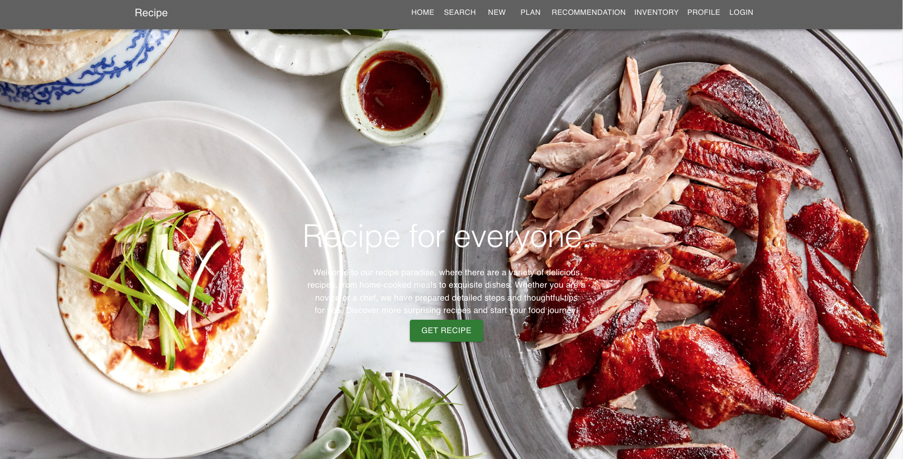
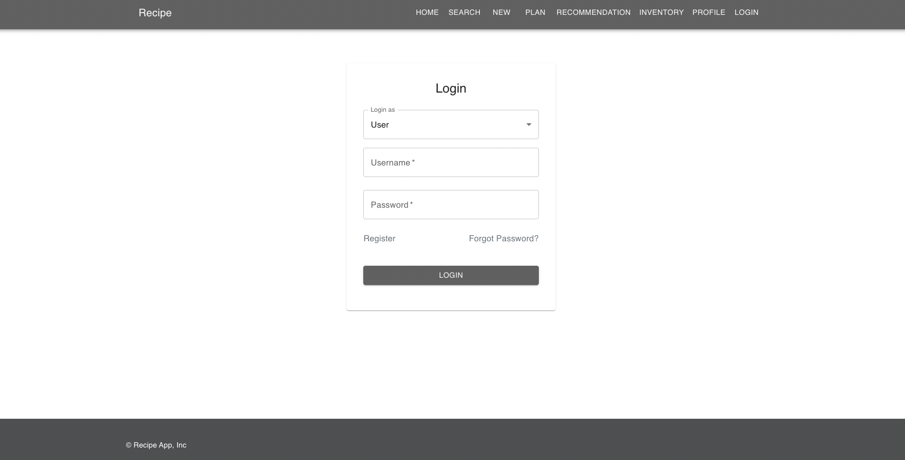
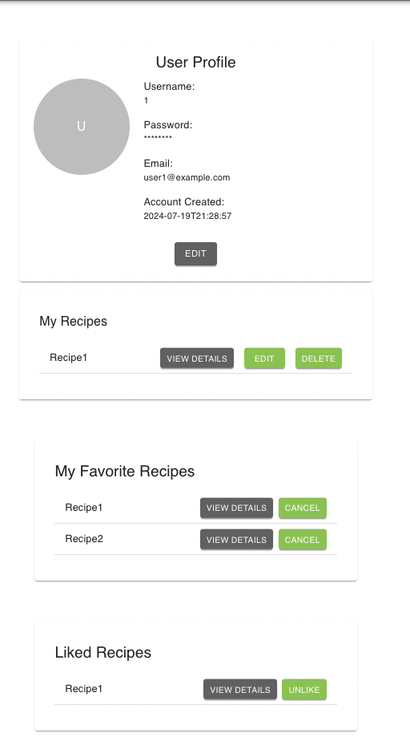
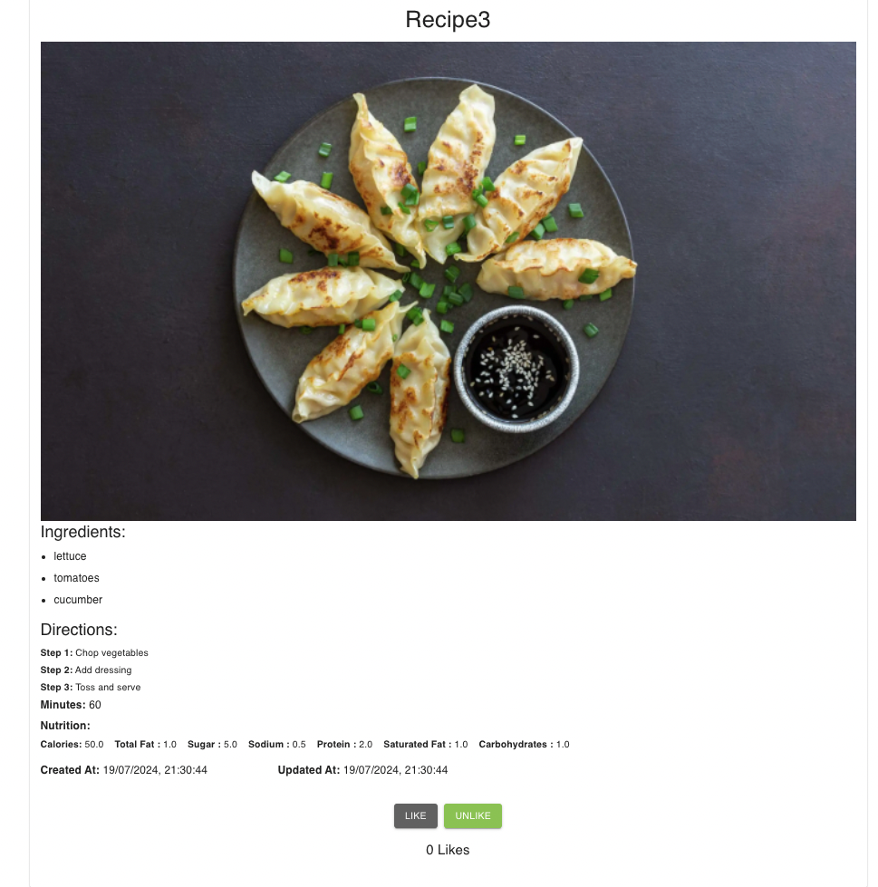
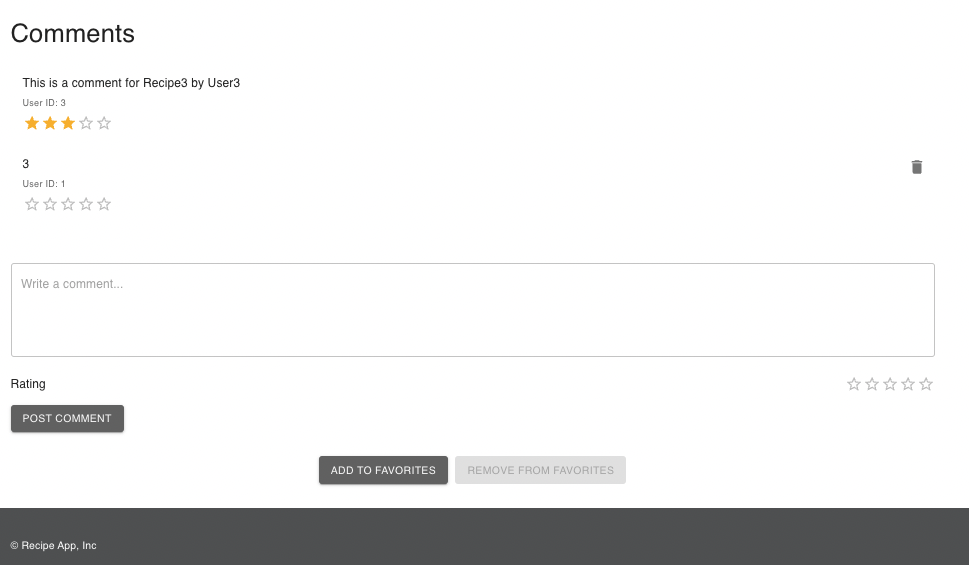
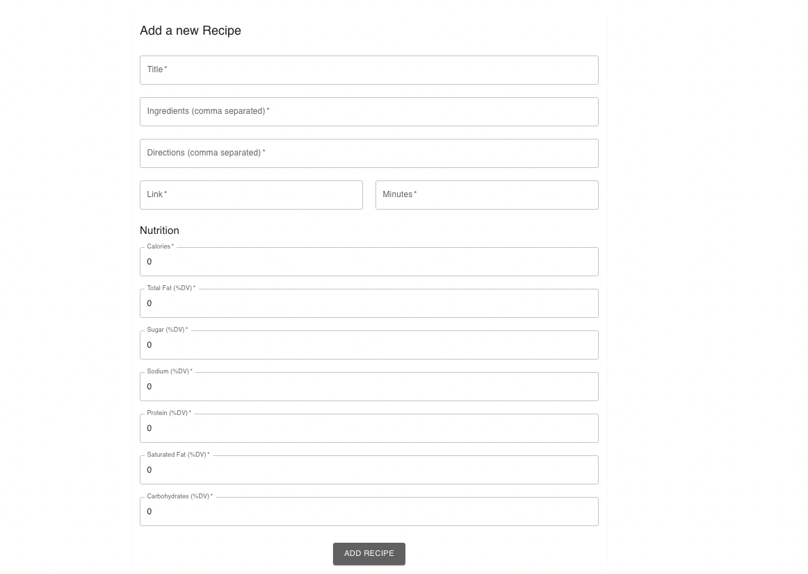
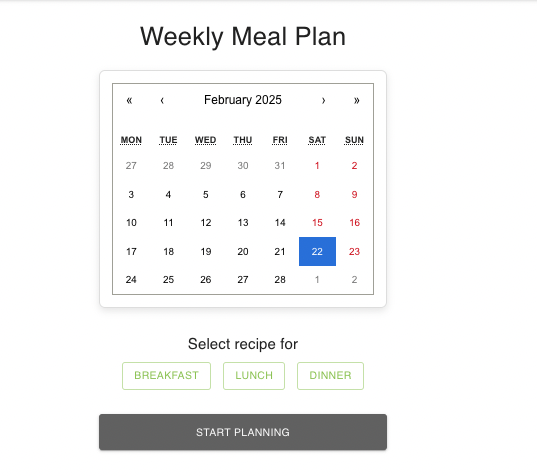
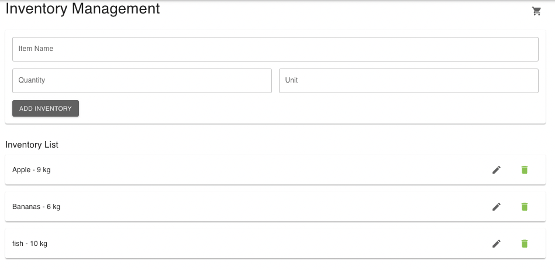
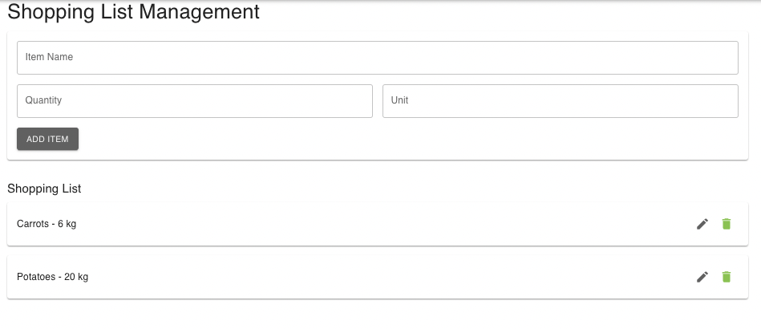
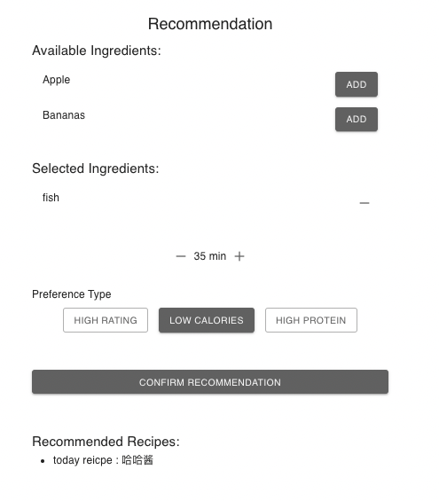

# Recipe Management System

A **React Native Web** app designed for managing recipes, meal planning, inventory tracking, and more. Optimized for **web-based platforms**, this application allows users to explore, save, and organize recipes while integrating meal planning and inventory tracking features.

## Features

### 1. **Home Page** 
- **Explore Recipes:** Browse a variety of delicious home-cooked and gourmet dishes.  
- **Quick Navigation:** Access search, meal planning, recommendations, and inventory tracking.  
- **Personalized Experience:** Get tailored recipe suggestions based on ingredients and preferences.

### 2. **User Authentication &User Profile Management**
- **Sign Up:** Create an account with a username, email, and password.
- **Login:** Secure authentication for registered users.
- **Forgot Password:** Users can recover their accounts through email verification.
 

- **View Profile:** Users can see their account details.
- **Edit Profile:** Modify and save user profile information.
- **Manage Recipes:** Users can create, edit, and delete their own recipes.
- **Manage Favorite Recipes:** Add and remove favorite recipes for easy access.

 

### 3. **Recipe Management**
- **Recipe Listings:** Browse categorized recipes (Breakfast, Lunch, Dinner).
- **Recipe Details:** View ingredients, step-by-step instructions, and user interactions.
- **Recipe Likes and Comments:** Interact with recipes through likes and reviews.

 
 
 
 - **CRUD Operations:** Create, edit, and delete recipes.
 

### 4. **Meal Planning**
- **Weekly Meal Planner:** Assign recipes to specific days for structured meal organization.
- **Themed Meal Plans:** Get suggestions like "High Protein," "Quick & Easy," etc.

### 5. **Inventory Management**
- **Add/Edit/Delete Inventory Items:** Keep track of available ingredients.
- **Quantity and Unit Tracking:** Ensures accurate inventory data.
- **Shopping List Generation:** Automatically generates a shopping list from meal plans.
 

### 6. **Recipe Recommendations**
- **Ingredient-Based Recommendations:** Suggests recipes based on available ingredients.
- **Dietary Preference Filters:** Choose "High Protein," "Low Calories," or "Highly Rated" recipes.
 

